<!--  -->
# ブログを作ろう
> [!TIP]
> Hugo.Extendedは標準のHugoより機能が多いため、このガイドではHugo.Extendedを使用します。

## 準備
### VS Codeのインストール
VS CodeはMicrosoftが開発した無料かつオープンソースのテキストエディタで、Windows、macOS、Linuxの3つのプラットフォームをサポートしています。

#### VS Codeのダウンロードとインストール
[VS Codeダウンロードページ](https://code.visualstudio.com/Download)を開き、使用しているOSに適したインストーラーを選択してください。


インストーラーを実行し、インストールウィザードに従ってインストールしてください。


#### VS Codeの設定
インストール後、デスクトップからVisual Studio Codeを開き、以下のプラグインを検索してインストールしてください：

    

インストール後、VS Codeを再起動すると、ソフトウェア全体が中文で表示されます。


最後に「ファイル」をクリックして「自動保存」を有効にします。

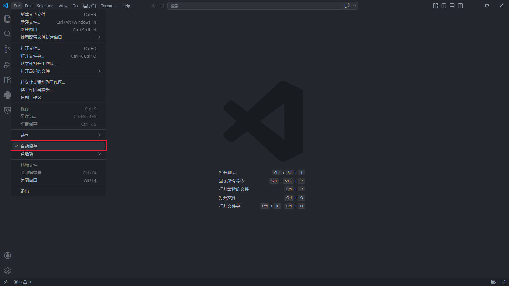

### Gitのインストール
> Gitは分散バージョン管理システムで、ソースコードやデータのバージョンを管理できます。ソフトウェア開発者が共同開発でソースコードを管理するために一般的に使用されています<br>
> — <cite>[Wikipedia](https://en.wikipedia.org/wiki/Git)より引用</cite>

#### Gitのダウンロードとインストール
[Gitダウンロードページ](https://git-scm.com/install/windows)を開き、使用しているOSに適したインストーラーをダウンロードしてください。


Gitインストーラーを実行し、「Next」をクリックして以下の画面が表示されたら、図示したオプションにチェックを入れてインストールを完了してください。


### GitHubの設定
#### GitHubアカウントを登録する
[GitHubホームページ](https://github.com)を開き、「Sign up」をクリックして、情報を入力して登録を完了してください。

  

#### 新規リポジトリを作成する
[GitHubホームページ](https://github.com)に行き、「New」をクリックして[新しいリポジトリ](https://github.com/new)を作成し、「Repository name」に「あなたのGitHubユーザー名.github.io」を入力し、「Description」にプロジェクトの説明を入力し、「Add a README file」にチェックを入れてください。

  

#### SSH鍵を設定する
スタートメニューで「Git Bash」を検索して開くか、デスクトップの空白處を右クリックし、「Open Git Bash Here」を選択してください。


以下のコマンドを実行します（`your_email@example.com`をあなたのメールアドレスに置き換えてください）。確認を求められたらEnterを押してください：
```
ssh-keygen -t ed25519 -C "your_email@example.com"
cat ~/.ssh/id*.pub
```

2番目のコマンドの出力をコピーし、[SSH鍵設定ページ](https://github.com/settings/ssh/new)を開き、「Title」に名前を入力し（例：「私の作業PC」）、「Key type」はデフォルトのままにし、コピーした公開鍵を「Key」フィールドに貼り付けてください。
> [!IMPORTANT]
> 鍵の最後にスペースがないことを確認してください！


最後にターミナルでSSH接続をテストします。`xxx! You've successfully authenticated, but GitHub does not provide shell access.`が表示されれば接続成功です。


## Hugoのインストール
### WindowsにHugoをインストールする
#### MicrosoftのWindowsパッケージマネージャーwingetを使用する

* **Hugo Extendedをインストール**
```
winget install Hugo.Hugo.Extended
```
* **Hugo Extendedをアンインストール**
```
winget uninstall --name "Hugo (Extended)"
```
#### GitHubのコンパイル済みバイナリを使用する
[GitHub](https://github.com/gohugoio/hugo/releases/latest)から`hugo_extended_x.xxx.x_windows-amd64.zip`をダウンロードし、解凍してから[環境変数を設定](https://zhuanlan.zhihu.com/p/646247339)してください


### LinuxにHugoをインストールする
#### パッケージマネージャーを使用する

* **Ubuntu/Debianシステム**
    * aptでHugo Extendedをインストール
    ```bash
    sudo apt-get update
    sudo apt-get install hugo
    ```

* **Fedoraシステム**
    * dnfでインストール
    ```bash
    sudo dnf install hugo
    ```

* **Arch Linuxシステム**
    * pacmanでインストール
    ```bash
    sudo pacman -S hugo
    ```

#### コンパイル済みバイナリを使用する
> [!TIP]
> この方法は最新バージョンのHugo、特にExtendedバージョンを取得できます

1. [Hugoリリースページ](https://github.com/gohugoio/hugo/releases/latest)を開き、システムに適したファイルをダウンロード：
   * 64ビットシステム：`hugo_extended_x.xxx.x_linux-amd64.tar.gz`
   * 32ビットシステム：`hugo_extended_x.xxx.x_linux-386.tar.gz`
   * ARMアーキテクチャ：対応する `hugo_extended_x.xxx.x_linux-arm64.tar.gz`

2. ターミナルを開き、ダウンロードしたファイルのディレクトリに移動：
```bash
cd /path/to/downloaded/file
```

3. ファイルを解凍：
```bash
tar -zxvf hugo_extended_x.xxx.x_linux-amd64.tar.gz
```

4. Hugo実行ファイルをシステムパスに移動：
```bash
sudo mv hugo /usr/local/bin/
```

5. インストールを確認：
```bash
hugo version
```
出力が`hugo v0.160.1-d6bc8165e62b29d7d70ede01ed01d0f88de327e6+extended xxx/amd64 BuildDate=2026-04-08T14:02:42Z VendorInfo=gohugoio`に類似していれば、インストール成功です。

## プロジェクトを編集する
### プロジェクトに入る
* 新しい空のフォルダを英名で作成
* VS Codeを開き、「フォルダを開く...」をクリックし、先ほど作成したフォルダを選択


`Ctrl + J`を押してターミナルを開き、[私のプロジェクト](https://github.com/GuGuIsNotAPigeon/hugo-theme-stack)[^1]をクローン
[^1]: このプロジェクトはJimmyさんのStackテーマをAIで改変したものです

> [!TIP]
> 中国のユーザーは2番目のコマンドを優先的に使用してください

**Windowsユーザー**
```
git clone https://github.com/GuGuIsNotAPigeon/hugo-theme-stack.git .\
git clone https://gh-proxy.org/https://github.com/GuGuIsNotAPigeon/hugo-theme-stack.git .\
```
**Linux/macOSユーザー**
```
git clone https://github.com/GuGuIsNotAPigeon/hugo-theme-stack.git ./
git clone https://gh-proxy.org/https://github.com/GuGuIsNotAPigeon/hugo-theme-stack.git ./
```

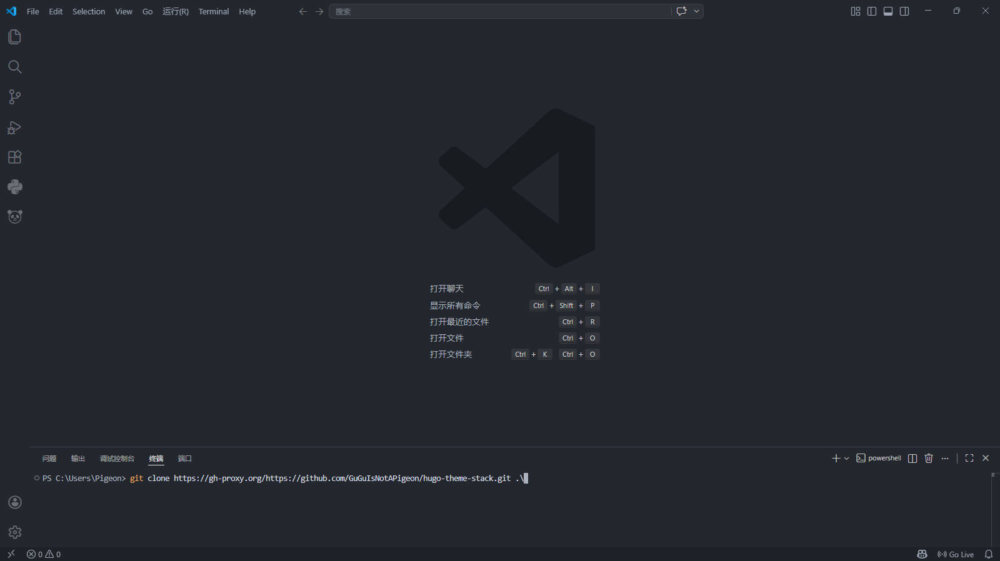

### プロジェクトを変更する
* 左側のエクスプローラーで`config\_default\languages.toml`を開き、`title`の後の内容をあなたのニックネームに変更し、`subtitle`の後にサブタイトルを入力
* `config\_default\params.toml`を開き、`[sidebar]`の下の`avatar`でアバターリンクを変更
* `config\_default\hugo.toml`を開き、`baseURL = "https://guguisnotapigeon.github.io/"`を`https://あなたのGitHubユーザー名.github.io`に変更

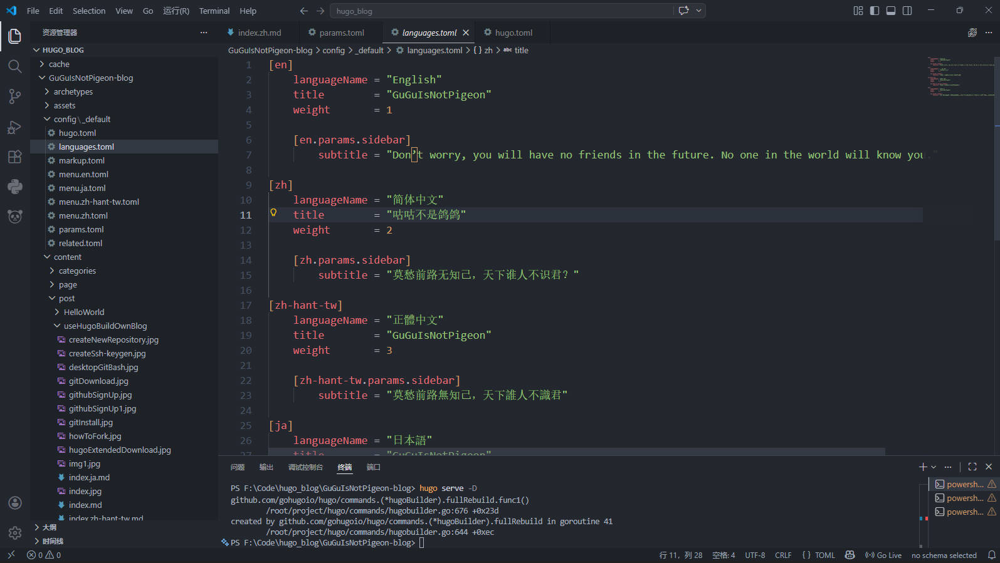  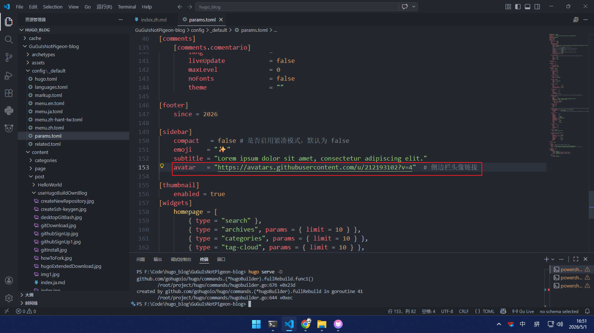  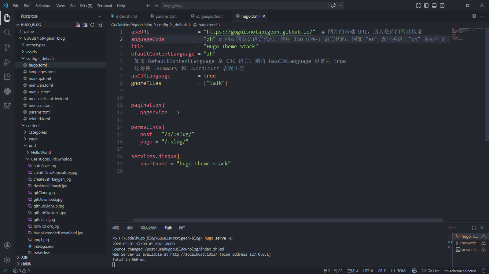

* 他のファイルの変更については、元の作成者の[チュートリアル](https://stack.cai.im/ja/guide/)を参照し、実際の状況に応じて調整してください

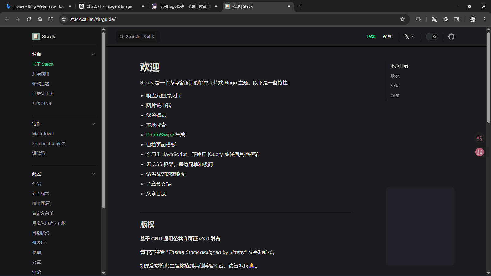

> [!TIP]
> テキストやリンクに関係なく、英数字ダブルクォーテーション内で変更する必要があります

* ターミナルで以下のコマンドを実行し、`Ctrl`キーを押しながら`http://localhost:xxxx`をクリックしてブラウザでウェブサイトをプレビュー：
```
hugo serve -D
```

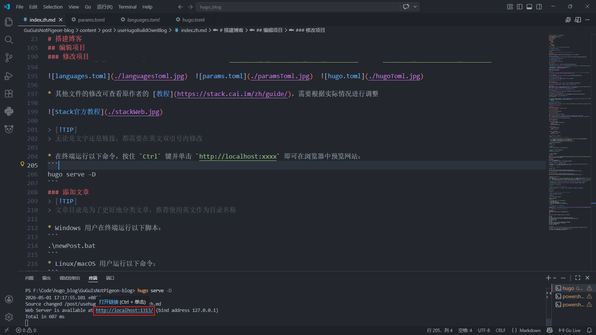

### 記事を追加する
> [!TIP]
> 記事ディレクトリは記事をより良く分類するためのものです。ディレクトリ名には英語を使用することをお勧めします

* Windowsユーザーはターミナルで以下のスクリプトを実行：
```
.\newPost.bat
```
* Linux/macOSユーザーは以下のコマンドを実行：
```
chmod +x ./newPost.sh
./newPost.sh
```

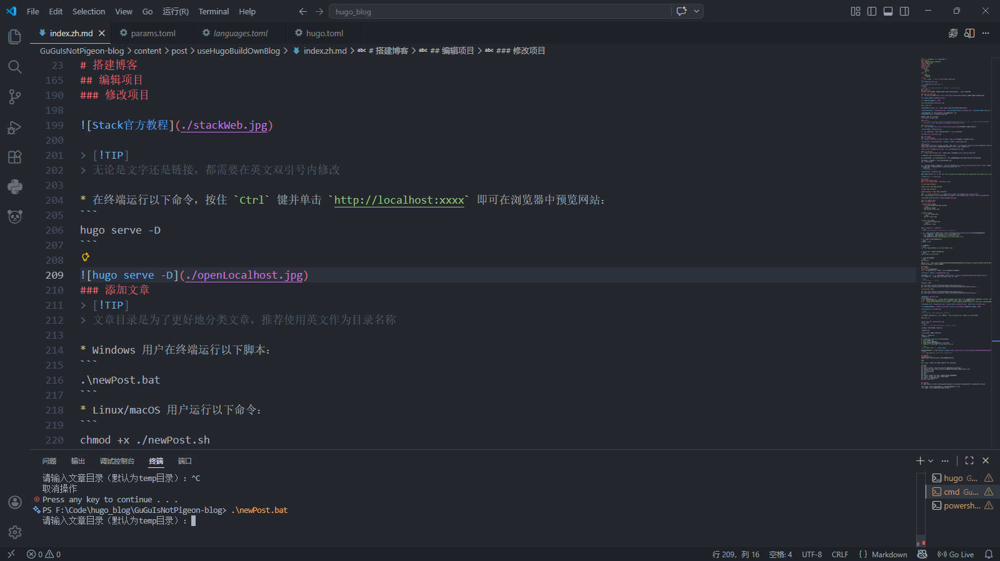

対応するディレクトリの`index.ja.md`を開き、以下の内容を変更：
* `title`：記事タイトル
* `description`：記事説明
* `image`：記事カバー画像パス（相対パスを使用可能）
* `comments`：コメントセクションの切り替え（オン：`true`、オフ：`false`）

> [!TIP]
> `draft: true`を`draft: false`に変更してください

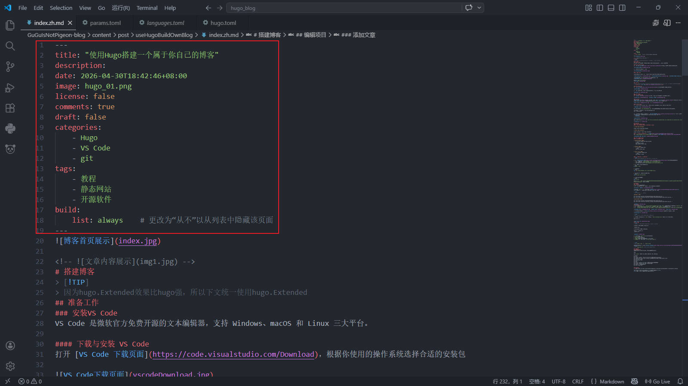

記事の内容については、元の作成者の[Markdown構文ガイド](https://demo.stack.cai.im/ja/p/markdown-syntax/)を参照してください

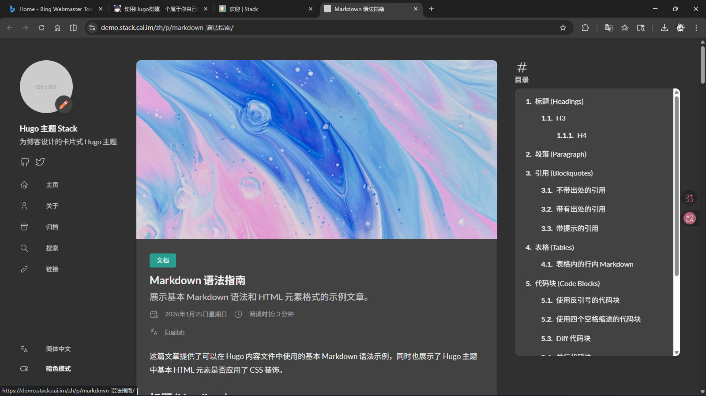
> [!TIP]
> `hugo serve -D`を実行すると、記事の変更をリアルタイムで確認できます

## ウェブサイトをデプロイする
### 静的ページを生成する
記事を書き終わったら、プロジェクトルートで以下のコマンドを実行して静的ページを生成：
```
hugo
```

多くのファイルが`public`フォルダに表示されます。

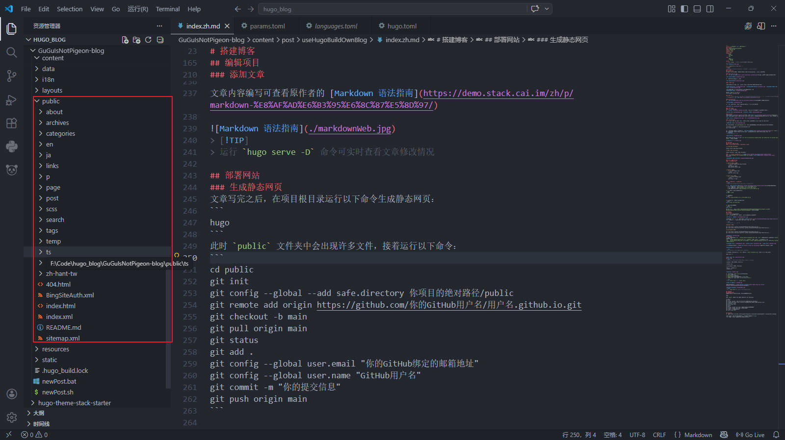

次に以下のコマンドを実行：
```
cd public
git init
git config --global --add safe.directory /absolute/path/to/your/project/public
git remote add origin https://github.com/your-github-username/your-github-username.github.io.git
git checkout -b main
git pull origin main
git status
git add .
git config --global user.email "your-github-email@example.com"
git config --global user.name "your-github-username"
git commit -m "Your commit message"
git push origin main
```

### プロジェクトをプッシュする
GitHubリポジトリを開き、「Settings」→「Pages」をクリックし、「Branch」を「None」から「main」に変更し、「Save」をクリック

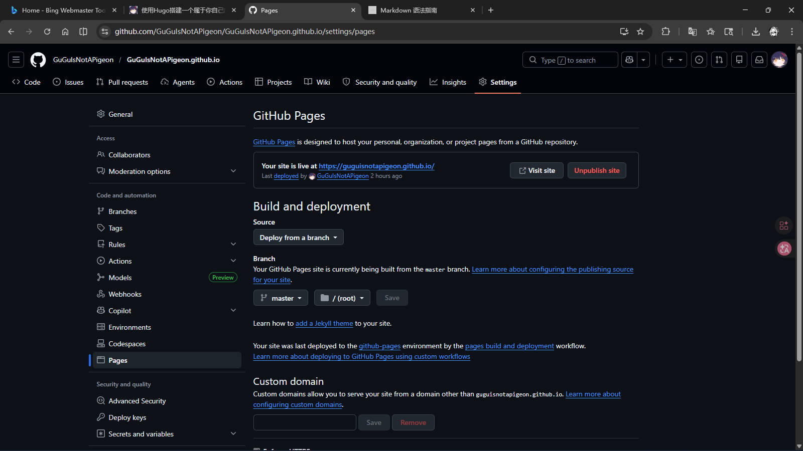

GitHubのデプロイが完了するのを待ちます。その後、以下のアドレスでブログにアクセスできます[^2]

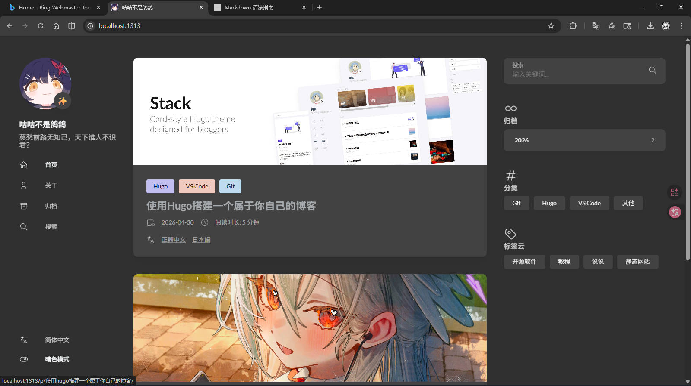

[^2]: アドレスは https://your-github-username.github.io
> [!NOTE]クイックメモ
> その後のプッシュは`gitPush.bat`を実行してください

インストーラーを実行し、インストールウィザードに従ってインストールしてください。


#### VS Codeの設定
インストール後、デスクトップからVisual Studio Codeを開き、以下のプラグインを検索してインストールしてください：

    

インストール後、VS Codeを再起動すると、ソフトウェア全体が中文で表示されます。


### Gitのインストール
> Gitは分散バージョン管理システムで、ソースコードやデータのバージョンを管理できます。ソフトウェア開発者が共同開発でソースコードを管理するために一般的に使用されています<br>
> — <cite>[Wikipedia](https://en.wikipedia.org/wiki/Git)より引用</cite>

#### Gitのダウンロードとインストール
[Gitダウンロードページ](https://git-scm.com/install/windows)を開き、使用しているOSに適したインストーラーをダウンロードしてください。


Gitインストーラーを実行し、「Next」をクリックして以下の画面が表示されたら、図示したオプションにチェックを入れてインストールを完了してください。


### GitHubの設定
#### GitHubアカウントを登録する
[GitHubホームページ](https://github.com)を開き、「Sign up」をクリックして、情報を入力して登録を完了してください。

  

#### 新規リポジトリを作成する
[GitHubホームページ](https://github.com)に行き、「New」をクリックして[新しいリポジトリ](https://github.com/new)を作成し、「Repository name」に「あなたのGitHubユーザー名.github.io」を入力し、「Description」にプロジェクトの説明を入力し、「Add a README file」にチェックを入れてください。

  

#### SSH鍵を設定する
スタートメニューで「Git Bash」を検索して開くか、デスクトップの空白处を右クリックし、「Open Git Bash Here」を選択してください。


以下のコマンドを実行します（`your_email@example.com`をあなたのメールアドレスに置き換えてください）。確認を求められたらEnterを押してください：
```
ssh-keygen -t ed25519 -C "your_email@example.com"
cat ~/.ssh/id*.pub
```

2番目のコマンドの出力をコピーし、[SSH鍵設定ページ](https://github.com/settings/ssh/new)を開き、「Title」に名前を入力し（例：「私の作業PC」）、「Key type」はデフォルトのままにし、コピーした公開鍵を「Key」フィールドに貼り付けてください。
> [!IMPORTANT]
> 鍵の最後にスペースがないことを確認してください！


最後にターミナルでSSH接続をテストします。`xxx! You've successfully authenticated, but GitHub does not provide shell access.`が表示されれば接続成功です。


## Hugoのインストール
### WindowsにHugoをインストールする
#### MicrosoftのWindowsパッケージマネージャーwingetを使用する

* **Hugo Extendedをインストール**
```
winget install Hugo.Hugo.Extended
```
* **Hugo Extendedをアンインストール**
```
winget uninstall --name "Hugo (Extended)"
```
#### GitHubのコンパイル済みバイナリを使用する
[GitHub](https://github.com/gohugoio/hugo/releases/latest)から`hugo_extended_x.xxx.x_windows-amd64.zip`をダウンロードし、解凍してから[環境変数を設定](https://zhuanlan.zhihu.com/p/646247339)してください


### LinuxにHugoをインストールする
#### パッケージマネージャーを使用する

* **Ubuntu/Debianシステム**
    * aptでHugo Extendedをインストール
    ```bash
    sudo apt-get update
    sudo apt-get install hugo
    ```

* **Fedoraシステム**
    * dnfでインストール
    ```bash
    sudo dnf install hugo
    ```

* **Arch Linuxシステム**
    * pacmanでインストール
    ```bash
    sudo pacman -S hugo
    ```

#### コンパイル済みバイナリを使用する
> [!TIP]
> この方法は最新バージョンのHugo、特にExtendedバージョンを取得できます

1. [Hugoリリースページ](https://github.com/gohugoio/hugo/releases/latest)を開き、システムに適したファイルをダウンロード：
   * 64ビットシステム：`hugo_extended_x.xxx.x_linux-amd64.tar.gz`
   * 32ビットシステム：`hugo_extended_x.xxx.x_linux-386.tar.gz`
   * ARMアーキテクチャ： соответствующий `hugo_extended_x.xxx.x_linux-arm64.tar.gz`

2. ターミナルを開き、ダウンロードしたファイルのディレクトリに移動：
```bash
cd /path/to/downloaded/file
```

3. ファイルを解凍：
```bash
tar -zxvf hugo_extended_x.xxx.x_linux-amd64.tar.gz
```

4. Hugo実行ファイルをシステムパスに移動：
```bash
sudo mv hugo /usr/local/bin/
```

5. インストールを確認：
```bash
hugo version
```
出力が`hugo v0.160.1-d6bc8165e62b29d7d70ede01ed01d0f88de327e6+extended xxx/amd64 BuildDate=2026-04-08T14:02:42Z VendorInfo=gohugoio`に類似していれば、インストール成功です。

## プロジェクトを編集する
### プロジェクトに入る
* 新しい空のフォルダを英名で作成
* VS Codeを開き、「フォルダを開く...」をクリックし、先ほど作成したフォルダを選択


`Ctrl + J`を押してターミナルを開き、[私のプロジェクト](https://github.com/GuGuIsNotAPigeon/hugo-theme-stack)[^1]をクローン
[^1]: このプロジェクトはJimmyさんのStackテーマをAIで改変したものです

> [!TIP]
> 中国のユーザーは2番目のコマンドを優先的に使用してください

**Windowsユーザー**
```
git clone https://github.com/GuGuIsNotAPigeon/hugo-theme-stack.git .\
git clone https://gh-proxy.org/https://github.com/GuGuIsNotAPigeon/hugo-theme-stack.git .\
```
**Linux/macOSユーザー**
```
git clone https://github.com/GuGuIsNotAPigeon/hugo-theme-stack.git ./
git clone https://gh-proxy.org/https://github.com/GuGuIsNotAPigeon/hugo-theme-stack.git ./
```

### プロジェクトを変更する
* 左側のエクスプローラーで`config\_default\languages.toml`を開き、`title`の後の内容をあなたのニックネームに変更し、`subtitle`の後にサブタイトルを入力
* `config\_default\params.toml`を開き、`[sidebar]`の下の`avatar`でアバターリンクを変更
* 他のファイルの変更については、元の作成者の[チュートリアル](https://stack.cai.im/ja/guide/)を参照し、実際の状況に応じて調整してください

> [!TIP]
> テキストやリンクに関係なく、英数字ダブルクォーテーション内で変更する必要があります

* ターミナルで以下のコマンドを実行し、`Ctrl`キーを押しながら`http://localhost:xxxx`をクリックしてブラウザでウェブサイトをプレビュー：
```
hugo serve -D
```

### 記事を追加する
> [!TIP]
> 記事ディレクトリは記事をより良く分類するためのものです。ディレクトリ名には英語を使用することをお勧めします

* Windowsユーザーはターミナルで以下のスクリプトを実行：
```
.\newPost.bat
```
* Linux/macOSユーザーは以下のコマンドを実行：
```
chmod +x ./newPost.sh
./newPost.sh
```

対応するディレクトリの`index.ja.md`を開き、以下の内容を変更：
* `title`：記事タイトル
* `description`：記事説明
* `image`：記事カバー画像パス（相対パスを使用可能）
* `comments`：コメントセクションの切り替え（オン：`true`、オフ：`false`）

> [!TIP]
> `draft: true`を`draft: false`に変更してください

記事の内容については、元の作成者の[Markdown構文ガイド](https://demo.stack.cai.im/ja/p/markdown-syntax/)を参照してください
> [!TIP]
> `hugo serve -D`を実行すると、記事の変更をリアルタイムで確認できます

## ウェブサイトをデプロイする
### 静的ページを生成する
記事を書き終わったら、プロジェクトルートで以下のコマンドを実行して静的ページを生成：
```
hugo
```

多くのファイルが`public`フォルダに表示されます。次に以下のコマンドを実行：
```
cd public
git init
git config --global --add safe.directory /absolute/path/to/your/project/public
git remote add origin https://github.com/your-github-username/your-github-username.github.io.git
git checkout -b main
git pull origin main
git status
git add .
git config --global user.email "your-github-email@example.com"
git config --global user.name "your-github-username"
git commit -m "Your commit message"
git push origin main
```

### プロジェクトをプッシュする
GitHubリポジトリを開き、「Settings」→「Pages」をクリックし、「Branch」を「None」から「main」に変更し、「Save」をクリック

GitHubのデプロイが完了するのを待ちます。その後、以下のアドレスでブログにアクセスできます[^2]：
[^2]: アドレスは https://your-github-username.github.io