<!-- 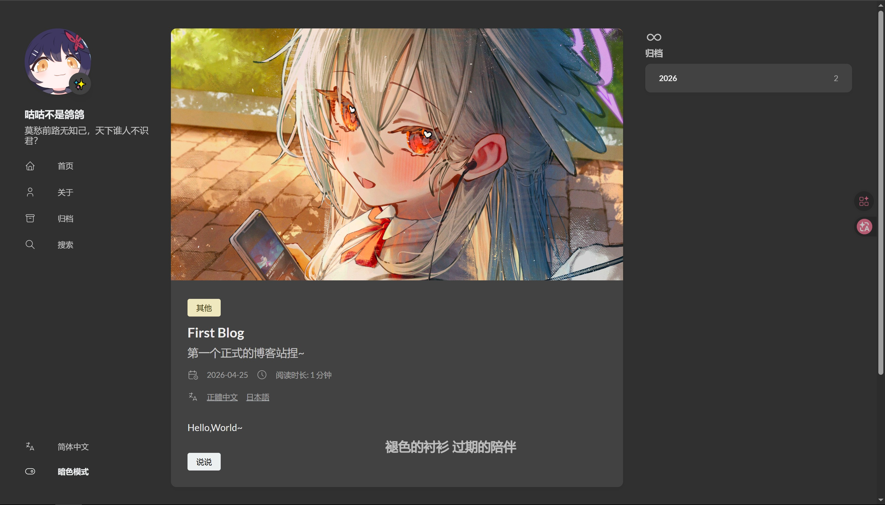 -->
# 搭建部落格
> [!TIP]
> 因為 Hugo.Extended 比標準 Hugo 功能更強，因此本指南統一使用 Hugo.Extended

## 準備工作
### 安裝 VS Code
VS Code 是 Microsoft 官方免費開源的文字編輯器，支援 Windows、macOS 和 Linux 三大平台。

#### 下載與安裝 VS Code
打開 [VS Code 下載頁面](https://code.visualstudio.com/Download)，根據你使用的作業系統選擇合適的安裝包

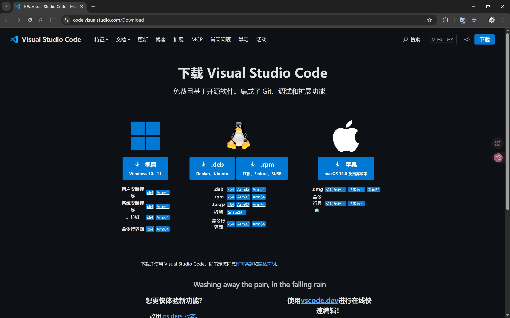

執行安裝包並按照安裝提示進行安裝

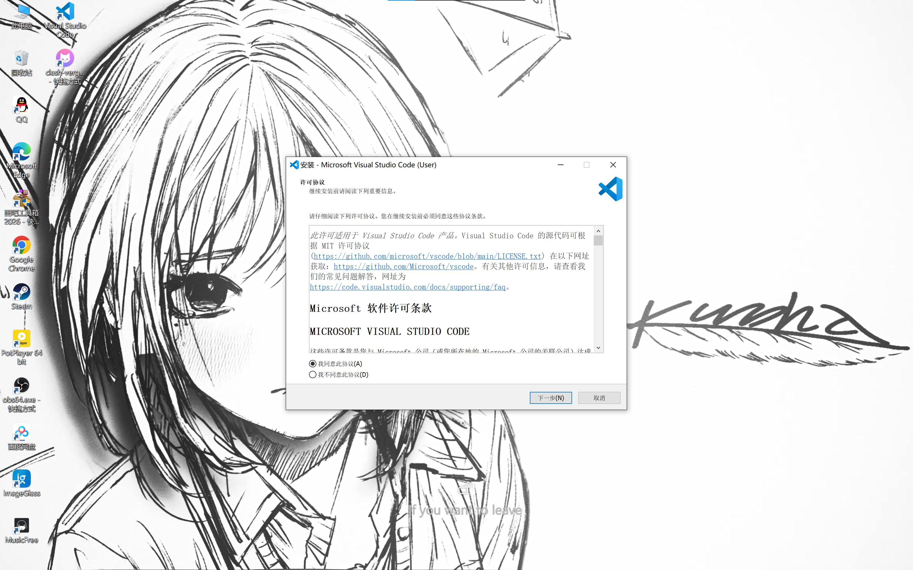

#### 配置 VS Code
安裝完畢後，在桌面雙擊打開 Visual Studio Code，分別搜尋並安裝以下插件：

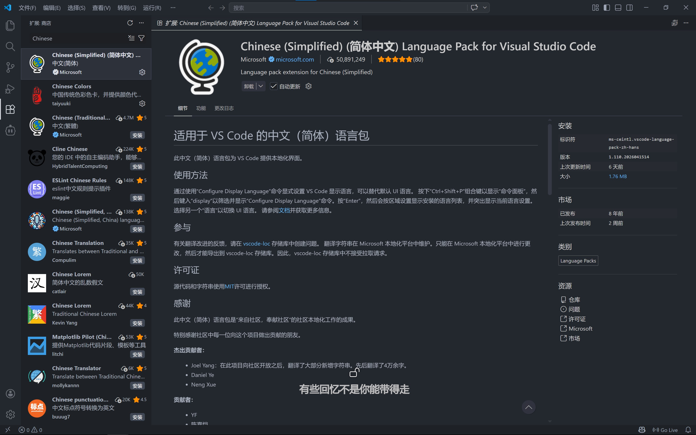  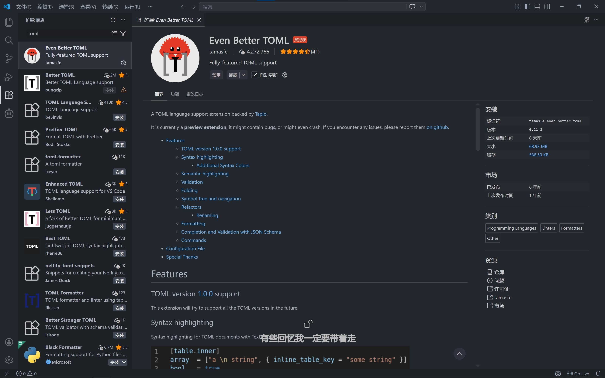  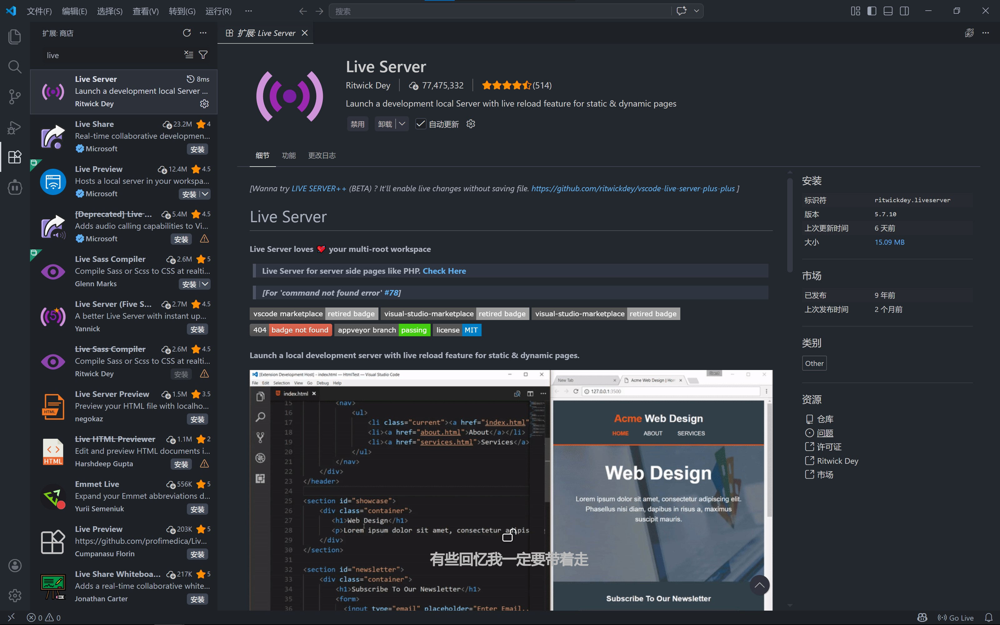

安裝完成後重啟 VS Code，此時整個軟體介面就會變成中文

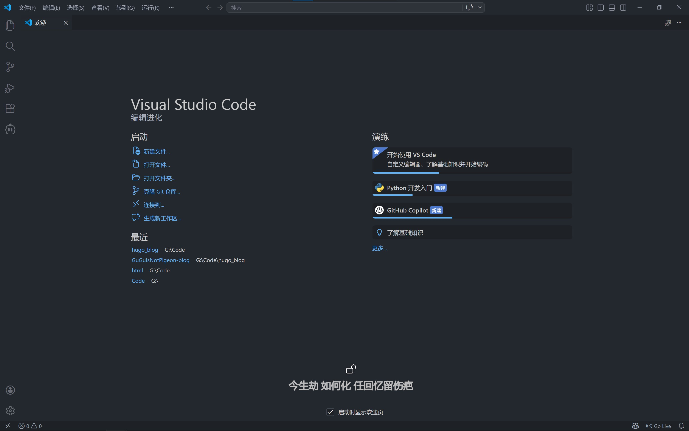

### 安裝 Git
> Git 是一個分散式版本控制軟體系統，能夠管理原始碼或資料的版本。它通常用於軟體開發者協作開發時控制原始碼<br>
> — <cite>摘錄自 [維基百科](https://en.wikipedia.org/wiki/Git)</cite>

#### 下載並安裝 Git
打開 [Git 下載頁面](https://git-scm.com/install/windows)，選擇適合你作業系統的安裝包下載

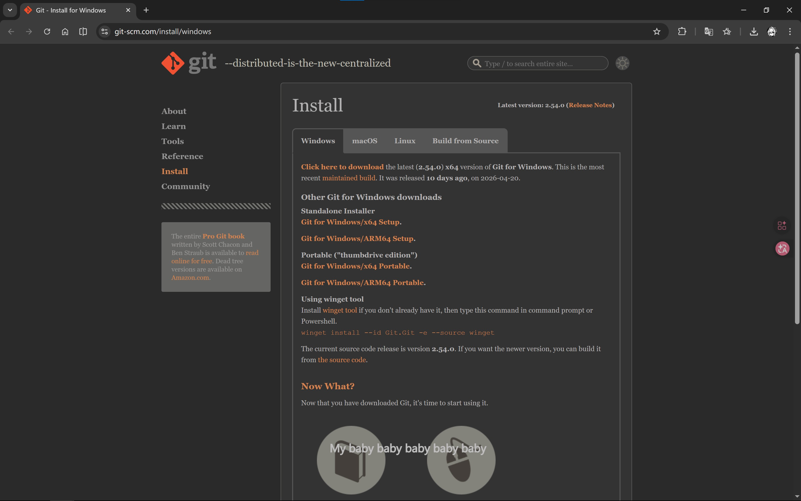

執行 Git 安裝包，點擊「Next」來到以下介面，按照圖示勾選後完成安裝

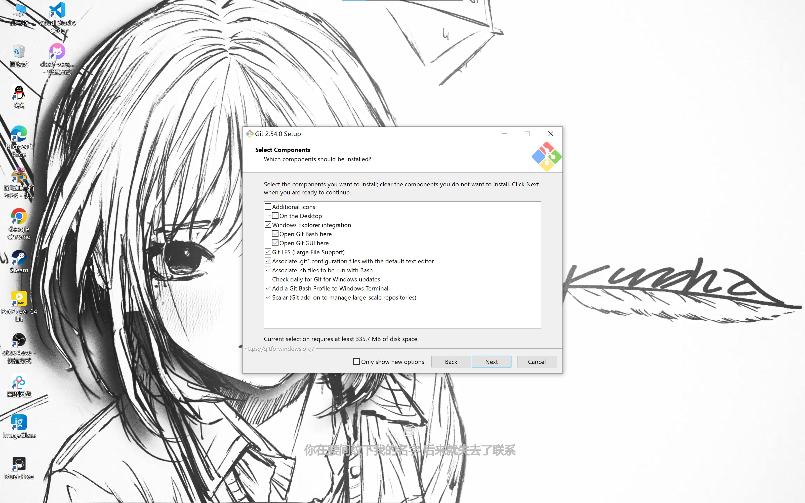

### 配置 GitHub
#### 註冊 GitHub 帳號
打開 [GitHub 首頁](https://github.com)，點擊「Sign up」，根據你的真實資訊填寫，完成註冊

  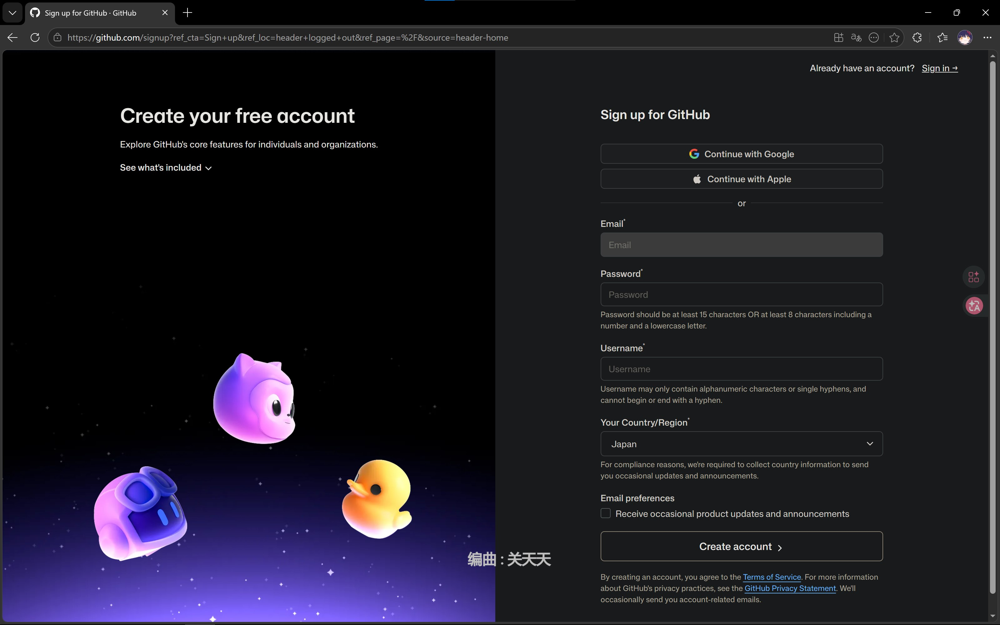

#### 新建專案
[來到 GitHub 首頁](https://github.com)，點擊「New」[新建一個空倉庫](https://github.com/new)，「Repository name」填寫「你的 GitHub 使用者名稱.github.io」，「Description」填寫你對該專案的描述，同時勾選「Add a README file」

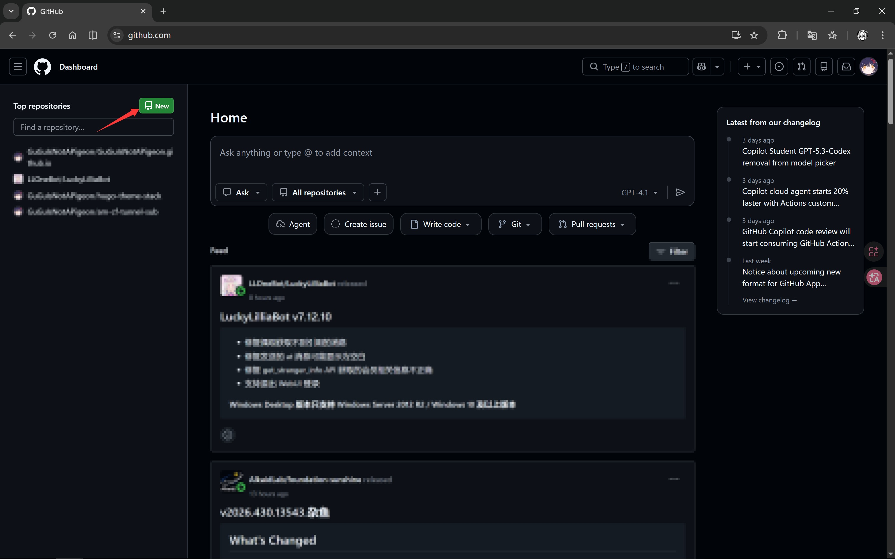  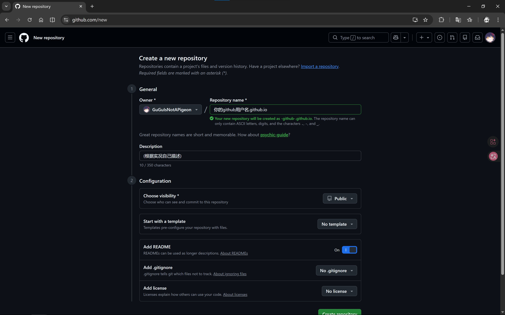

#### 配置 SSH 金鑰
在開始選單中搜尋「Git Bash」並打開，或者在桌面空白處按右鍵，選擇「Open Git Bash Here」

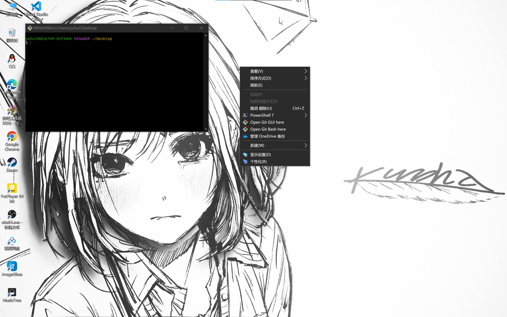

執行以下命令（將 `your_email@example.com` 替換為你的電子郵件地址），如果詢問是否確認，直接按 Enter 即可：
```
ssh-keygen -t ed25519 -C "your_email@example.com"
cat ~/.ssh/id*.pub
```

把第二條命令輸出的文字複製下來，打開 [SSH 金鑰設定頁面](https://github.com/settings/ssh/new)，在「Title」裡填寫一個名稱（如「我的工作電腦」），「Key type」保持預設不變，將複製的公鑰文字貼上到「Key」框中
> [!IMPORTANT]
> 金鑰最後面不能有空格！

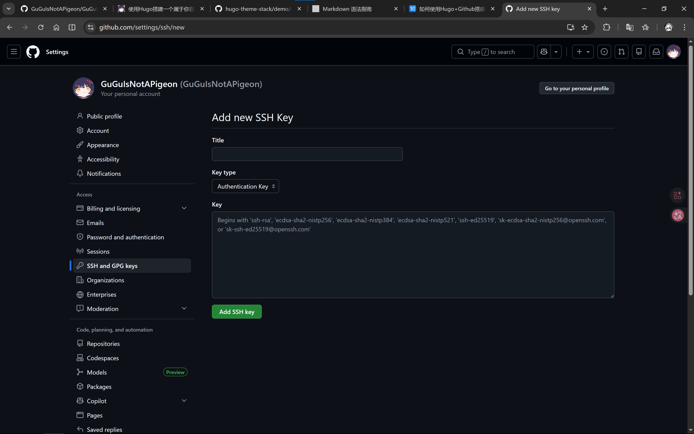

最後在終端機測試 SSH 連線，出現 `xxx! You've successfully authenticated, but GitHub does not provide shell access.` 即表示連線成功

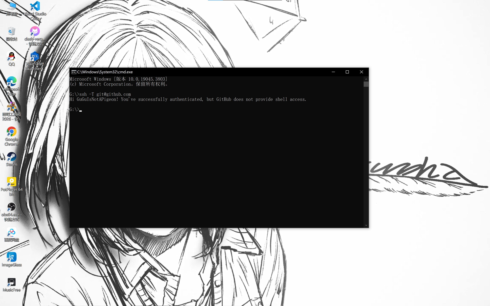

## 安裝 Hugo
### Windows 系統安裝 Hugo
#### 使用 Microsoft 官方的 Windows 套件管理員 winget

* **安裝 Hugo Extended**
```
winget install Hugo.Hugo.Extended
```
* **解除安裝 Hugo Extended**
```
winget uninstall --name "Hugo (Extended)"
```
#### 使用 GitHub 上已編譯好的 [二進制檔案](https://github.com/gohugoio/hugo/releases/latest)
下載 `hugo_extended_x.xxx.x_windows-amd64.zip`，解壓後 [配置環境變數](https://zhuanlan.zhihu.com/p/646247339)

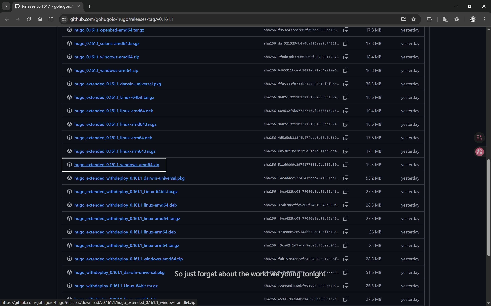

### Linux 系統安裝 Hugo
#### 使用套件管理員

* **Ubuntu/Debian 系統**
    * 使用 apt 套件管理員安裝 Hugo Extended
    ```bash
    sudo apt-get update
    sudo apt-get install hugo
    ```

* **Fedora 系統**
    * 使用 dnf 套件管理員安裝
    ```bash
    sudo dnf install hugo
    ```

* **Arch Linux 系統**
    * 使用 pacman 套件管理員安裝
    ```bash
    sudo pacman -S hugo
    ```

#### 使用編譯好的二進制檔案安裝
> [!TIP]
> 此方法可以取得最新版本的 Hugo，特別是 Extended 版本

1. 打開 [Hugo Releases 頁面](https://github.com/gohugoio/hugo/releases/latest)，下載適合你系統的檔案：
   * 64 位元系統：下載 `hugo_extended_x.xxx.x_linux-amd64.tar.gz`
   * 32 位元系統：下載 `hugo_extended_x.xxx.x_linux-386.tar.gz`
   * ARM 架構：下載對應的 `hugo_extended_x.xxx.x_linux-arm64.tar.gz`

2. 打開終端機，進入下載檔案的目錄：
```bash
cd /path/to/downloaded/file
```

3. 解壓檔案：
```bash
tar -zxvf hugo_extended_x.xxx.x_linux-amd64.tar.gz
```

4. 將 Hugo 執行檔移動到系統路徑：
```bash
sudo mv hugo /usr/local/bin/
```

5. 驗證是否安裝成功：
```bash
hugo version
```
如果輸出類似於 `hugo v0.160.1-d6bc8165e62b29d7d70ede01ed01d0f88de327e6+extended xxx/amd64 BuildDate=2026-04-08T14:02:42Z VendorInfo=gohugoio` 即表示安裝成功

## 編輯專案
### 進入專案
* 建立一個空白的英文資料夾
* 打開 VS Code，點擊「開啟資料夾...」，選擇你剛才建立的資料夾


按 `Ctrl + J` 打開終端機，克隆 [我的專案](https://github.com/GuGuIsNotAPigeon/hugo-theme-stack)[^1]
[^1]: 此專案是基於 Jimmy 大佬設計的 Stack 主題用 AI 二改的

> [!TIP]
> 中國使用者優先使用第二條命令

**Windows 使用者**
```
git clone https://github.com/GuGuIsNotAPigeon/hugo-theme-stack.git .\
git clone https://gh-proxy.org/https://github.com/GuGuIsNotAPigeon/hugo-theme-stack.git .\
```
**Linux/macOS 使用者**
```
git clone https://github.com/GuGuIsNotAPigeon/hugo-theme-stack.git ./
git clone https://gh-proxy.org/https://github.com/GuGuIsNotAPigeon/hugo-theme-stack.git ./
```

### 修改專案
* 在左側的檔案總管中打開 `config\_default\languages.toml`，將 `title` 後面的內容修改為你的暱稱，`subtitle` 後填寫副標題
* 打開 `config\_default\params.toml`，在 `[sidebar]` 下的 `avatar` 中修改你的頭像連結
* 其他檔案的修改可查看原作者的 [教學](https://stack.cai.im/zh-hant-tw/guide/)，需要根據實際情況進行調整

> [!TIP]
> 無論是文字還是連結，都需要在英文雙引號內修改

* 在終端機執行以下命令，按住 `Ctrl` 鍵並點擊 `http://localhost:xxxx` 即可在瀏覽器中預覽網站：
```
hugo serve -D
```

### 新增文章
> [!TIP]
> 文章目錄是為了更好地分類文章，建議使用英文作為目錄名稱

* Windows 使用者在終端機執行以下腳本：
```
.\newPost.bat
```
* Linux/macOS 使用者執行以下命令：
```
chmod +x ./newPost.sh
./newPost.sh
```

打開對應目錄的 `index.zh-hant-tw.md`，修改以下內容：
* `title`：文章標題
* `description`：文章描述
* `image`：文章封面圖片位址（可使用相對路徑）
* `comments`：開關評論區（開：`true`，關：`false`）

> [!TIP]
> 請將 `draft: true` 改為 `draft: false`

文章內容編寫可查看原作者的 [Markdown 語法指南](https://demo.stack.cai.im/zh-hant-tw/p/markdown-syntax/)
> [!TIP]
> 執行 `hugo serve -D` 命令可即時查看文章修改情況

## 部署網站
### 產生靜態網頁
文章寫完之後，在專案根目錄執行以下命令產生靜態網頁：
```
hugo
```

此時 `public` 資料夾中會出現許多檔案，接著執行以下命令：
```
cd public
git init
git config --global --add safe.directory /absolute/path/to/your/project/public
git remote add origin https://github.com/your-github-username/your-github-username.github.io.git
git checkout -b main
git pull origin main
git status
git add .
git config --global user.email "your-github-email@example.com"
git config --global user.name "your-github-username"
git commit -m "Your commit message"
git push origin main
```

### 推送專案
打開你的 GitHub 倉庫，點擊「Settings」→「Pages」，在「Branch」中將「None」更改為「main」，點擊「Save」

等待 GitHub 部署完畢，之後就可以透過以下位址訪問你的部落格[^2]：
[^2]: 位址為 https://your-github-username.github.io

